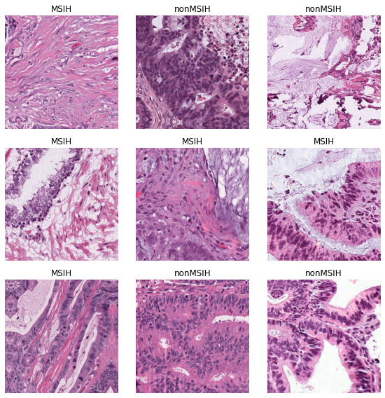
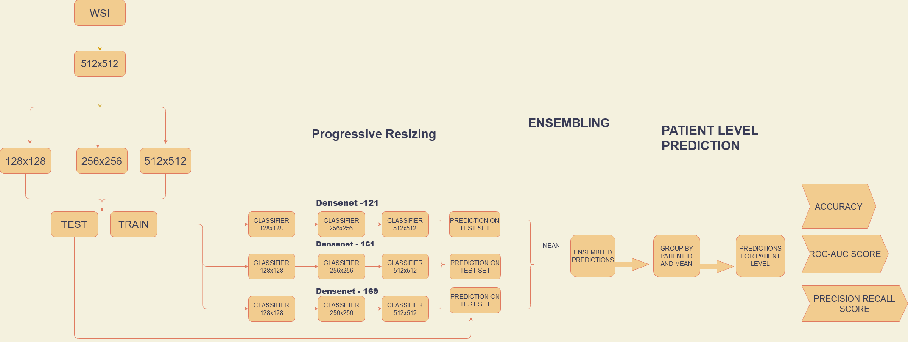
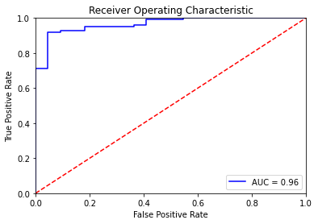
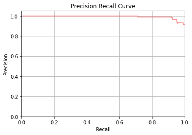
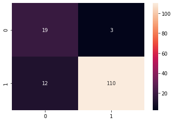

# Detection-of-tumor-mutation-in-histopathological-images-colorectal-cancer

This project involves a novel way to train CNN's for the purposes of detecting mutation in colorectal cancer cells. The pipiline involves training 3 different architectures each with 3 models of different resolutions, specifically 128x128, 256x256 and 512x512. Each model feeds their weight to a larger model similar to transfer learning. So in our case, 128x128--> 256x256 --> 512x512. The reason to do this is to overcome invariance in CNN, as the process involves cutting the original tumour tissue of a patient into several tiles because of memory restrictions to train on a GPU. 

> The images in this repo seems to break when night mode is ON.
 

## Data

The training data was downloaded from [here](https://zenodo.org/record/3832231). An example batch of training data at native resolution is shown below. MSIH is the tumour positive class and nonMSIH is tumour negative class. 

## Training pipeline

## Results of the final ensembled models
### Auc Score

### PR Curve

### Final predictions

All code can be seen in this [notebook](https://github.com/balaganeshmohan/Colorectal-cancer-classification-with-histopathological-images/blob/main/CancerClassification.ipynb) . 

## Acknowledgements 
Professor Rachel Cavill - Maastricht University

Professor Jakob Nicholas - Aachen University
